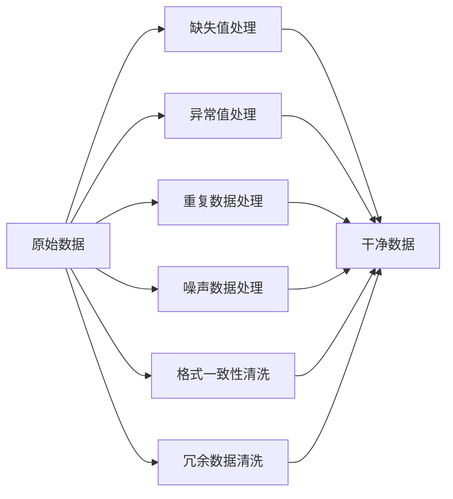

# Data Processing & Cleaning

> [!info] 概述
> 本文档系统整理数据清洗的完整知识体系，涵盖缺失值处理、异常值检测、重复数据清理、噪声去噪、格式一致性、冗余数据清洗六大核心领域，以及常用编程语言、专业工具、核心算法、专用程序框架。

---

## 一、缺失值处理

### 1.1 删除法

- **直接删除**：删除缺失样本 / 缺失字段
  > [!warning] 适用条件
  > 缺失比例极低、删除不影响样本分布

### 1.2 填充法（插值）

| 填充类型 | 说明 | 适用场景 |
|---------|------|---------|
| 统计填充 | 均值、中位数、众数填充 | 数值型数据 |
| 时序填充 | 前后向填充 | 时序数据常用 |
| 插值填充 | 线性插值、多项式插值 | 连续型数据 |
| 模型填充 | KNN、机器学习预测填充 | 缺失机制复杂 |

---

## 二、异常值处理

### 2.1 判别方法

| 方法 | 原理 | 适用条件 |
|-----|------|---------|
| **3σ 准则** | 正态分布下，偏离均值3倍标准差视为异常 | 数据服从正态分布 |
| **IQR 箱线图** | 四分位数间距法，Q1-1.5×IQR ~ Q3+1.5×IQR 以外为异常 | 非正态分布 |
| **Z-score 标准化** | |z| > 3 判定为异常 | 标准化后数据 |
| **聚类/统计模型** | DBSCAN、LOF 等方法检测离群点 | 复杂分布数据 |

### 2.2 处理方式

- 直接剔除异常值
- 截断 / 缩尾（Winsorize）
- 平滑修正、局部均值替换

---

## 三、重复数据处理

- **完全重复记录去重**：逐行对比，完全匹配则删除
- **关键字段唯一去重**：基于指定字段（如 ID）进行去重
- **模糊重复匹配**：文本、名称近似重复的识别与合并

---

## 四、噪声数据处理（平滑去噪）

> [!tip] 典型应用场景
> 遥感数据、时序数据、传感器数据

| 算法类型 | 具体方法 |
|---------|---------|
| 滑动窗口 | 移动平均平滑 |
| 滤波类 | 中值滤波、高斯滤波 |
| 变换类 | 小波去噪 |
| 邻域类 | 邻域平均法 |

---

## 五、数据格式与一致性清洗

### 5.1 格式统一

- 统一单位、统一量纲
- 统一时间格式、编码格式

### 5.2 文本标准化

- 去空格、大小写统一
- 错别字修正

### 5.3 字段处理

- 字段拆分、合并、规范命名

### 5.4 逻辑校验

> [!caution] 校验规则示例
> - 年龄不能为负数
> - 结束时间必须晚于开始时间
> - 数值字段在合理范围内

---

## 六、冗余与无关数据清洗

- 删除无关特征、冗余字段
- 降维剔除高度相关变量
- 样本筛选：过滤无效、不合格、离群样本

---

# 数据清洗工具链全景图

> [!abstract] 分类框架
> **编程语言 → 专业软件工具 → 核心算法 → 专用程序/框架**

---

## 一、常用编程语言

### 1. Python（科研首选）

> [!tip] 生态优势
> 生态最全、库最多、清洗能力最强

| 核心库 | 功能定位 |
|-------|---------|
| **Pandas** | 表格清洗主力 |
| **NumPy** | 数值运算、缺失值处理 |
| **SciPy** | 插值、滤波、统计异常检测 |
| **Dask** | 超大数据集清洗 |

**适合场景**：表格、时序、遥感、文本、问卷、大数据清洗

### 2. R 语言

| 核心库 | 功能定位 |
|-------|---------|
| **dplyr** | 数据操作与转换 |
| **tidyr** | 数据整洁化 |
| **cleaner** | 数据清洗专用 |

**适合场景**：统计建模、医学、社科问卷数据清洗

### 3. SQL

**适用场景**：去重、筛选、缺失查询、一致性校验、批量规整

**常用数据库**：MySQL、PostgreSQL、SQLite

### 4. MATLAB

**特点**：自带缺失值、滤波、异常值函数

**适合场景**：传感器、影像、时序实验数据

### 5. Rust / Go

> [!note] 性能优势
> 速度远超 Python，适合批量离线清洗

**适合场景**：超大文件、高并发、工业级数据清洗

### 6. Java / Scala

**适用场景**：配合 Spark 做海量数据清洗

---

## 二、专业软件工具

| 工具 | 定位 | 核心功能 |
|-----|------|---------|
| **Excel / WPS 表格** | 基础清洗 | 去重、筛选、条件格式、缺失标记、分列 |
| **SPSS** | 社科统计 | 缺失值分析、异常值检测、数据规整 |
| **Origin** | 实验数据 | 曲线去噪、平滑、异常点剔除 |
| **ArcGIS / QGIS** | 测绘遥感专用 | 矢量数据清洗（重叠、缝隙、拓扑纠错）、影像去噪 |
| **Tableau / Power BI** | 可视化辅助 | 一眼看出异常、缺失、分布问题 |
| **OpenRefine** | 文本表格神器 | 自动去重、聚类归一、文本规整、批量修正错别字 |

---

## 三、数据清洗核心算法

### 3.1 缺失值处理算法

- 均值/中位数/众数填充
- 线性插值、样条插值
- KNN 近邻填充
- 随机森林/机器学习预测填充

### 3.2 异常值检测算法

| 算法 | 说明 |
|-----|------|
| 3σ 准则 | 正态分布异常检测 |
| IQR 四分位数箱线图 | 基于分位数的异常识别 |
| Z-Score 标准化 | 标准化分数判别 |
| DBSCAN | 聚类离群点检测 |
| LOF | 局部异常因子 |

### 3.3 去噪平滑算法

> [!tip] 典型应用
> 遥感数据、时序数据

| 算法 | 说明 |
|-----|------|
| 移动平均 | 滑动窗口均值平滑 |
| 中值滤波 | 排序取中值的非线性滤波 |
| 高斯滤波 | 加权平滑滤波 |
| 小波变换 | 多尺度去噪 |
| 邻域平滑 | 局部均值替换 |
| 卷积平滑 | 卷积核加权平均 |

### 3.4 去重与文本规整算法

- 哈希去重：高效精确匹配
- 模糊匹配：编辑距离（Levenshtein）相似度计算
- 文本分词、归一化

### 3.5 数据一致性规整

- 逻辑规则校验
- 单位统一量纲归一化
- 时序错位校正

---

## 四、专用程序 / 框架 / 库

### 4.1 Python 核心库

| 库 | 用途 |
|---|------|
| **Pandas** | 表格清洗主力 |
| **NumPy** | 数值运算、缺失值处理 |
| **SciPy** | 插值、滤波、统计异常检测 |
| **Dask** | 超大数据集清洗 |
| **Pandas-Profiling** | 一键自动数据清洗报告 |

### 4.2 大数据框架

| 框架 | 用途 |
|-----|------|
| **Apache Spark** | 分布式海量数据清洗 |
| **Hive** | SQL 批量清洗 |

### 4.3 遥感测绘专用库

| 库 | 用途 |
|---|------|
| **GDAL** | 遥感影像读写与预处理 |
| **Rasterio** | 遥感数据清洗、波段处理 |

---

# 附录：知识关联

>**tools**
 Hugging Face Datasets 加载数据；
 pandas/Polars 清洗与分析；
 Croissant 标准化数据集元数据，实现跨框架复用。

---

> [!success] 使用说明
> - 编程语言选择：Python 适合绝大多数场景，R 适合统计分析，大数据场景用 Spark
> - 工具选择：快速清洗用 Excel/OpenRefine，专业遥感用 GDAL/ArcGIS
> - 算法选择：根据数据特征（正态/非正态、时序/横截面）选择对应方法
